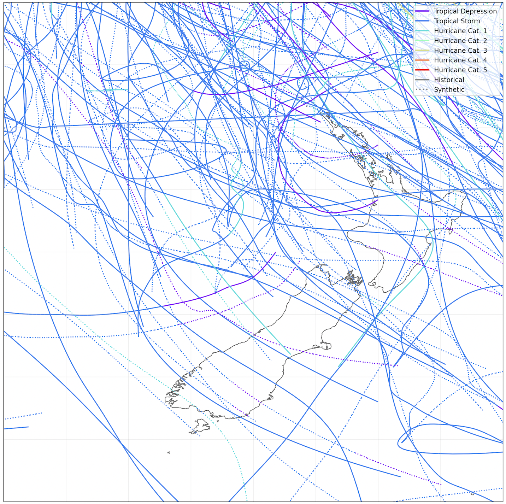
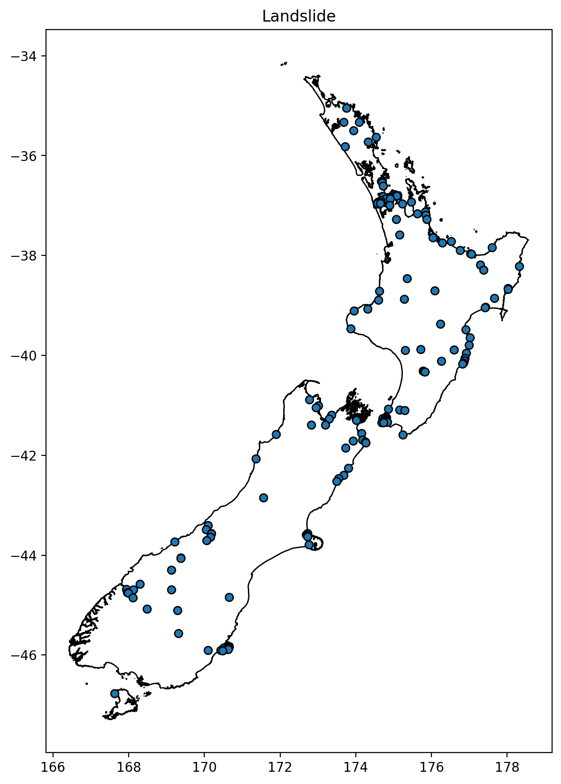
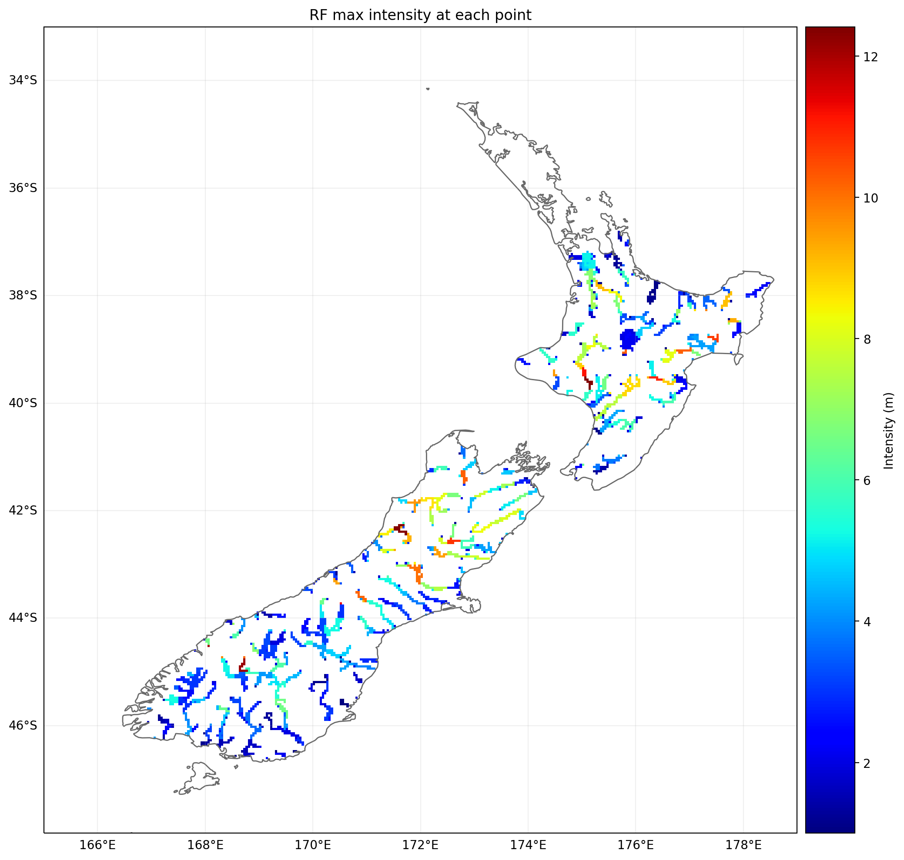
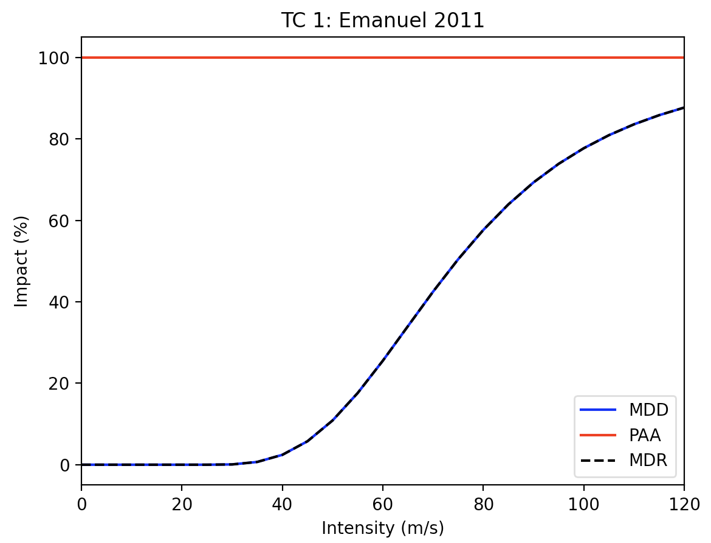
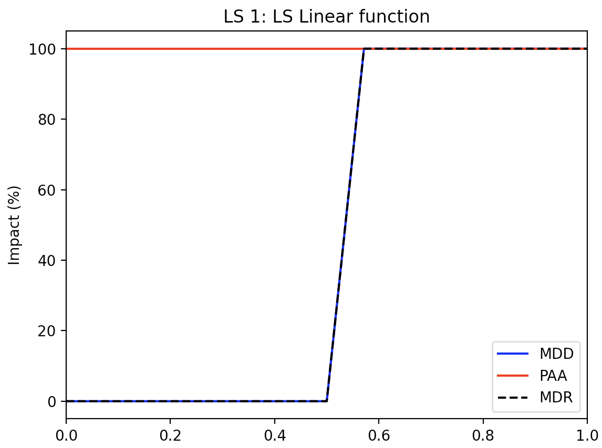
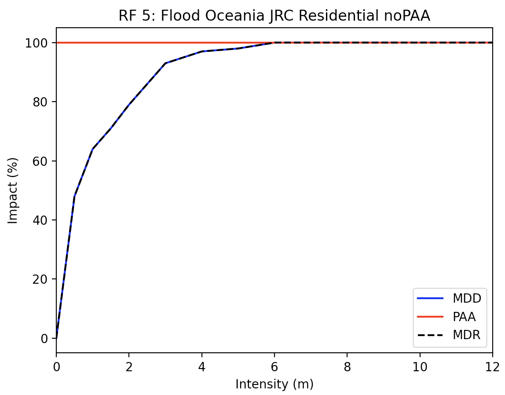

Concepts
#######

The base model in  **ClimateRisk** is CLIMADA, in this section, we provide a brief about several concepts about CLIMADA. 
Detailsa about how to use CLIMADA can be obtained from `CLIMADA documentation <https://climada-python.readthedocs.io/en/stable/index.html>`_.

1. Exposure
=========

1.1 Input data
--------

**Exposure** describes the set of assets, people, livelihoods, infrastructures, etc. within an area of interest 
in terms of their geographic location, their value etc.; in brief - everything potentially exposed to hazards.
In **ClimateRisk**, **Exposure** must be read as a `shp` file (it contains objects such as ``LineString`` or ``Point``).

For example, in ``etc/data`` there are three types of **Exposures**:

- ``lds-nz-railway-centre-lines-SHP``: New Zealand railway lines.
- ``lds-nz-road-centrelines-topo-150k-SHP``: New Zealand all roads (centre lines).
- ``nz-state-highway-centrelines-2012-SHP``: New Zealand state highways (centre lines).

We can choose the ``shp`` file in the configuration file, for example,

.. code-block:: yaml

    ...

    input:
        file: etc/data/nz-state-highway-centrelines-2012-SHP/nz-state-highway-centrelines-2012.shp
        ...
    ...

1.2 Exposure value
--------

By default, the value of the above **Exposures** (for each segment) is **1.0**. However it can be overwriten using references from 

- **LitPop**: it is used to initiate grided exposure data (with estimates of either asset value, economic activity or population) based on nightlight intensity (*Lit*) and population count (*Pop*) data. Details can be obtained `here <https://www.research-collection.ethz.ch/handle/20.500.11850/331316>`_.
- **GDP**: the exposed assets are calculated by means of national GDP converted to total national wealth as a proxy for asset distribution.
- **fixed value**: a user defined fixed value can be applied to **Exposures**.

The **Exposures** value can be configued in the ``value_adjustment_option`` section, for example,

.. code-block:: yaml

    ...

    input:
        ...
        value_adjustment_option: 
            litpop: null
            gdp2asset: null
            fix: 
                method: individual  # it can be set to individual or total
                value: 30

``litpop``, ``gdp2asset`` and ``value`` cannot be set to ``True`` at the same time. In the ``fix`` section, we need to set whether
we want to apply ``value`` (in the above configuration it is 30) over the entire **Exposures** (``method: total``), or for each segment (``method: individual``).

2. Hazard
=========

**Hazard** defines the climate hazards that are used to assess the impacts on the **Exposure**. 
Currently in **ClimateRisk**, three types of hazards are pre-defined: **TC**, **Flood** and **Landslide**.

2.1 Tropical cyclone (TC)
--------
A total of 175 years (up to 2022) Tropical cyclone (TC) records are used. Additionally, pertubated cyclone tracks are added in the dataset. Note that the dataset might not be comprehensive. An example of **TC** tracks is shown below:

2.2 Landslide
--------
Landslide is obtained from NASA Global Landslide Catalog (Points). It records most landslides globally. For New Zealand, there are a total of 164 events recorded spanning from 1979 to 2018. All the events are shown below:

2.3 Flood
--------
The runoff was used to derive spatially explicit flood depth (FLDDPH) and flooded fraction (FLDFRC) of the maximum flood event of each year on 150 arcsec (~ 5 km). For the New Zealand events, a total of 40 events spanning from 1971 and 2010 are recorded.

The type of **Hazard** can be defined in the configuration file. For example, in the following configuration file ``landslide`` is enabled in **ClimateRisk**:

.. code-block:: yaml

    ...

    hazard:
        flood:
            enable: False
        landslide:
            enable: True
        TC:
            enable: False
    ...

3. Impact function
=========
An impact function relates the percentage of damage in the exposure caused by an hazard (or a type of hazard). 
It is also referred as a "vulnerability curve" in the modelling community.

There are two main metrics in a impact function:

- ``MDD``: Mean damage (impact) degree for each intensity.
- ``PAA``: Percentage of affected assets (exposures) for each intensity.
- ``MDR``: ``MDR=MDD * PAA`` is the mean damage ratio.

There are a few predefined impact functions in **ClimateRisk** (by **CLIMADA**).

3.1 Tropical cyclone (TC)
--------

For Tropical cyclone, the impact function is defined using `Emanuel (2011) <https://journals.ametsoc.org/view/journals/wcas/3/4/wcas-d-11-00007_1.xml>`_.

The above figure shows that the analysis TC intensity range (wind speed) is between 0 m/s and 120 m/s. 
``PAA`` is always 100%, meaning that all areas of exposure will be affected if there is a TC event.
``MDD`` indicates that the TC start brining more significant impact when the TC intensity is more than 40 m/s.

3.2 Landslide
--------

For landslide, an customized impact function is defined (in ``process/impact.py``).

The intensity of landside is ranging from 0 to 1. When a landslide occurs, all areas of exposure will be affected while it only brings significant impacts when the landslide intensity is more than 0.5.

3.3 Flood
--------

For flood, the following impact function is defined as below

The unit of flood intensity is ``m``, when the intensity is over approximate ``1 m``, the impact (e.g., ``MDD``) from the event signifciantly increases.

In **ClimateRisk**, impact function is automatically determined by the predefined hazard type.

4. Cost benefit
=========
**Cost benefit** allows an user to compare different hazard adaptation options.

- When a **cost-benefit** ratio < 1, the cost is less than the benefit so the adaptation approach is considered a worthwhile investment (Smaller ratios therefore represent better investments).
- When a **cost-benefit** ratio > 1, the cost is more than the benefit and the offset losses are less than the cost of the adaptation measure: based on the financials alone (the measure may not be worth it).

4.1 A simple cost-benefit
--------

.. math::

    \frac{cost}{benefit} = \frac{cost}{N * (AAI^{without adaptation} - AAI^{with adaptation})}

Where ``N`` is the number of years, the ``AAI`` is the Average Annual Impact from your hazard event set on the exposure.

.. note::

    Whether an adaptation measure is seen to be effective might depend on the number of years you are evaluating the cost-benefit over. 
    For example, a $50 investment that prevents an average of $1 losses per year will only "break even" after ``N=50`` years. Details
    can be accessed from `CLIMADA <https://wcr.ethz.ch/research/climada.html>`_.

4.2 Time dependant cost-benefit
--------

Sometimes **Cost-benefit** calculation will want to describe a climate and exposure that also change over time.
In such case, it does not assume that the user will have explicit hazard and impact objects for every year in the study period, 
and so interpolates between the impacts at the start and the end of the period of interest.

.. math::

    \sum_{t=T_0}^{T_1} a(t)(AAI^{with adaptation}_{T_1} - AAI^{with adaptation}_{T_0} ) - N * AAI^{without adaptation}_{T_0}

Where ``a(t)`` is a function of the year ``t`` describing the interpolation of hazard and exposure between :math:`T_0` and :math:`T_1`.
It is usually defined as:

.. math::

    a_{k}(t) = \frac{(t - T_0)^{k}} {T_1 - T_0}^{k}

the choice (usually defined by user) determins how quickly the transition occurs between the present and future:

- ``k=1``: the function is a straightline (the change rate over time is stable). 
- ``k>1``: the change begins slowly and speeds up over time.
- ``k<1``: the change begins quickly and slows over time.

4.3 Discount rates
--------

The discount rate tries to formalise an idea from economics that says that a gain in the future is worth less to us than the same gain right now. 
For example, paying $1 to offset $2 of economic losses next year is **worth more** than paying $1 to offset $2 of economic losses in 2080.

There are three main ideas around discount rates:

- The most widley used discount rate in climate change economics is **1.4%** as proposed by the Stern Review (2006). 
- Neoliberal economists around Nordhaus (2007) claim that rates should be higher, around **4.3%**, reflecting continued economic growth and a society that will be better at adapting in the future compared to now. 
- Environmental economists argue that future costs shouldn **not** be discounted at all.

The **discount rates** can be considered in **Cost-benefits** calculation, details can be accessed `here <https://climada-python.readthedocs.io/en/stable/tutorial/climada_engine_CostBenefit.html#Discount-rates>`_.

