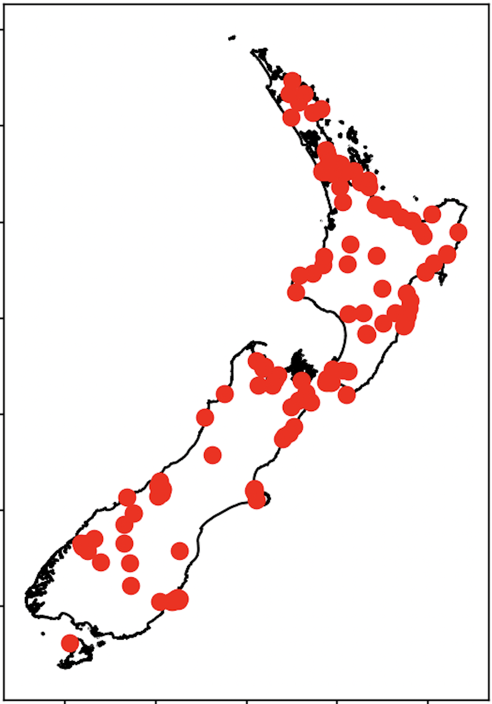

Concepts
#######

The base model in  **ClimateRisk** is CLIMADA, in this section, we provide a brief about several concepts about CLIMADA. 
Detailsa about how to use CLIMADA can be obtained from `CLIMADA documentation <https://climada-python.readthedocs.io/en/stable/index.html>`_.

1. Exposure
=========

1.1 Input data
--------

**Exposure** describes the set of assets, people, livelihoods, infrastructures, etc. within an area of interest 
in terms of their geographic location, their value etc.; in brief - everything potentially exposed to hazards.
In **ClimateRisk**, **Exposure** must be read as a `shp` file (it contains objects such as ``LineString`` or ``Point``).

For example, in ``etc/data`` there are three types of **Exposures**:

- ``lds-nz-railway-centre-lines-SHP``: New Zealand railway lines.
- ``lds-nz-road-centrelines-topo-150k-SHP``: New Zealand all roads (centre lines).
- ``nz-state-highway-centrelines-2012-SHP``: New Zealand state highways (centre lines).

We can choose the ``shp`` file in the configuration file, for example,

.. code-block:: yaml

    ...

    input:
        file: etc/data/nz-state-highway-centrelines-2012-SHP/nz-state-highway-centrelines-2012.shp
        ...
    ...

1.2 Exposure value
--------

By default, the value of the above **Exposures** (for each segment) is **1.0**. However it can be overwriten using references from 

- **LitPop**: it is used to initiate grided exposure data (with estimates of either asset value, economic activity or population) based on nightlight intensity (*Lit*) and population count (*Pop*) data. Details can be obtained `here <https://www.research-collection.ethz.ch/handle/20.500.11850/331316>`_.
- **GDP**: the exposed assets are calculated by means of national GDP converted to total national wealth as a proxy for asset distribution.
- **fixed value**: a user defined fixed value can be applied to **Exposures**.

The **Exposures** value can be configued in the ``value_adjustment_option`` section, for example,

.. code-block:: yaml

    ...

    input:
        ...
        value_adjustment_option: 
            litpop: null
            gdp2asset: null
            fix: 
                method: individual  # it can be set to individual or total
                value: 30

``litpop``, ``gdp2asset`` and ``value`` cannot be set to ``True`` at the same time. In the ``fix`` section, we need to set whether
we want to apply ``value`` (in the above configuration it is 30) over the entire **Exposures** (``method: total``), or for each segment (``method: individual``).

2. Hazard
=========

**Hazard** defines the climate hazards that are used to assess the impacts on the **Exposure**. 
Currently in **ClimateRisk**, three types of hazards are pre-defined: **TC**, **Flood** and **Landslide**.

2.1 Tropical cyclone (TC)
--------
A total of 175 years (up to 2022) Tropical cyclone (TC) records are used. Additionally, pertubated cyclone tracks are added in the dataset. An example of **TC** tracks is shown below:

.. image:: img/TC_tracks.png
   :width: 400

2.2 Landslide
--------
Landslide is obtained from NASA Global Landslide Catalog (Points). It records most landslides globally (For New Zealand, the data for the last 30 years are included).

