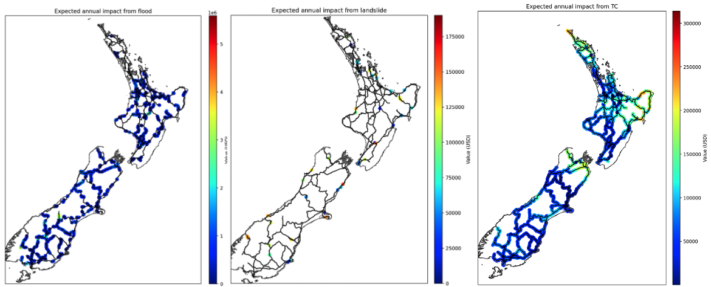
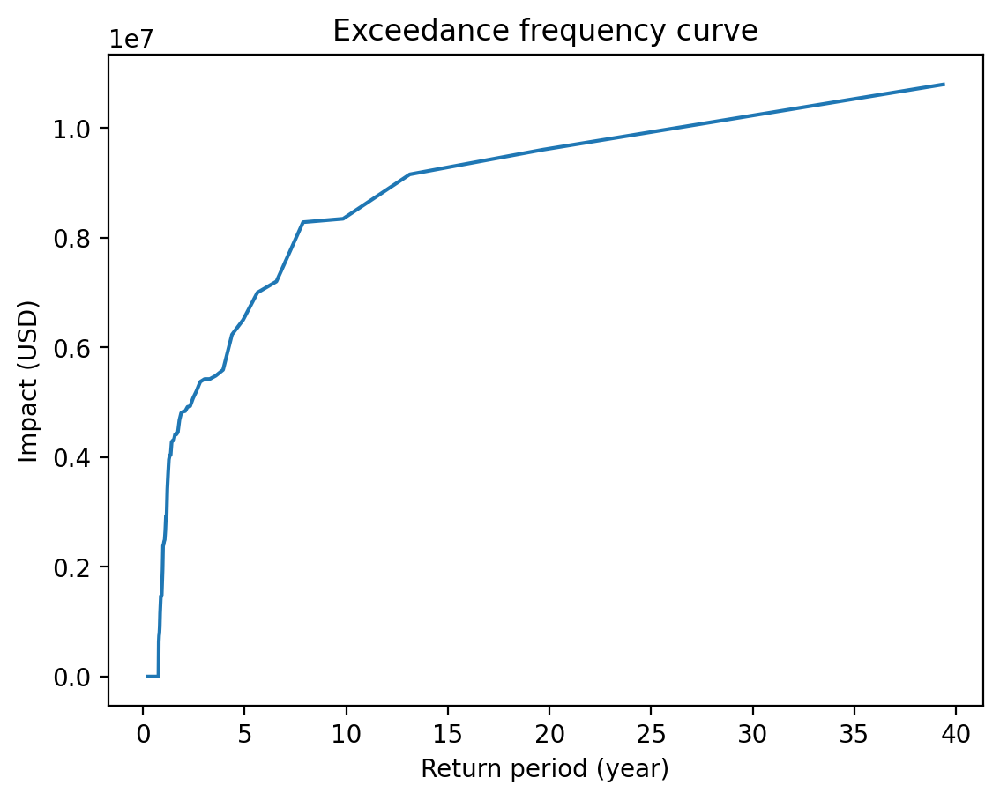
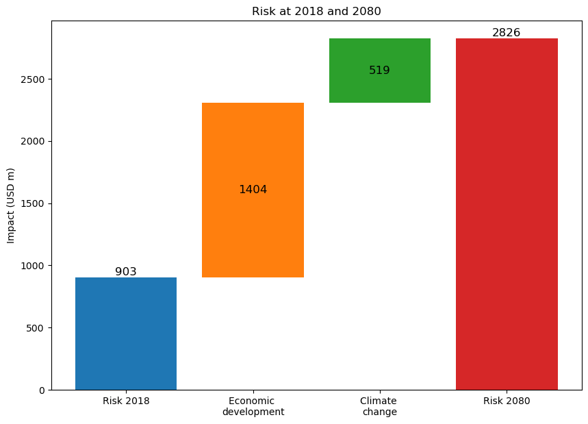
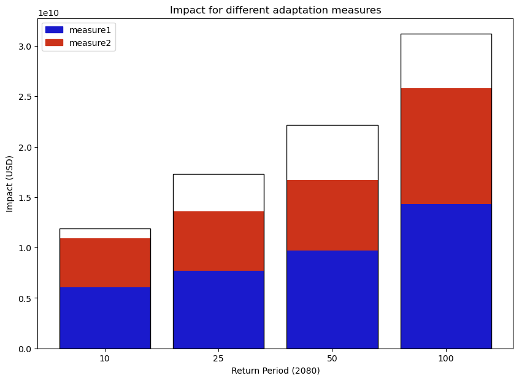

Cookbook
#######

1. Calculating climate risk impact
==========

In this example, the climate impacts on the New Zealand State Highway are calculated. Three hazard types: landslide, tropical cyclone and river flood are considered.

First we need to activate the **ClimateRisk** environment:

.. code-block:: bash

    conda activate climaterisk

Then the impact can be produced as:

.. code-block:: bash

    get_impact --workdir /tmp/climaterisk_data --cfg etc/cfg/nz_state_highway_impact.yaml

where ``--workdir`` indicates the working directory and the configuration file is defined from ``nz_state_highway_impact.yaml``. Note that the asset value **52 billion** is assigned in this configuration file.

With the historical hzards data up to 2020, the above command will give the impacts on the state highway from flood, landslide and tropical cyclone (TC).

As we can see, TC affects more areas across the country while the expected annual impact on average is not as significant as the one from landslide or flood.
The system also provides ``exceedance frequency curve`` for a particular type of hazard. For example, the below shows the exceedance frequency for landslide
over different return period.

2. Calculating Cost-benefit
==========

In this example, the Cost-benefit for a few different adapation measures on the New Zealand State Highway are calculated. The used hazard types is tropical cyclone.

First we need to activate the **ClimateRisk** environment:

.. code-block:: bash

    conda activate climaterisk

Then the impact can be produced as:

.. code-block:: bash

    get_benefit --workdir /tmp/climaterisk_data --cfg etc/cfg/nz_state_highway_cost_benefit.yaml

where ``--workdir`` indicates the working directory and the configuration file is defined from ``nz_state_highway_cost_benefit.yaml``.

In the configuration, we try to estimate different adaptation measures for the tropical cyclone impacts on the state highway system.
we assume that the average annual economy growth is ``1.5%``, and the future TC winds are obtained from the climate model senario ``RCP4.5``.

There are two adaptation measures in this configuration:

- ``measure 1``: it does not reduce the ``MDD`` (Mean damage (impact) degree for each intensity) however the ``PAA`` (Percentage of affected assets (exposures) for each intensity) is estimated to be reduced by 5% on average.
- ``measure 2``: it reduces ``MDD`` for 0.1, while it does not change ``PAA``.

The discount rate for both measures are 1.4%, and they are both estimated to cost 100 million dollars to implement.

First let's look at the Risk (in dollars) between 2018 and 2080. In 2018, the annual risk is estimated to $903 millions from the impacts of tropical cyclone. 
Between 2018 and 2080, the economic growth accounts for $1404m for the potnetial risk increase. In contrast, the climate change will bring an additional of $519m (after the adapation measures). 
In total, the impact_for_different_adaptations_TC risk in 2080 from TC is $2826m.

In terms of adapations, we can see that by implementing both measures, we are able to largely reduce the TC impacts even for a significant TC event with a return period of 100 years.
In general, ``measure1`` gives more positive impacts than ``measure2``.

3. Calculating Supply-chain impact
==========

In this example,  we calculate the direct and indirect supply-chain impacts for countries listed in Input-Output Database.

First we need to activate the **ClimateRisk** environment:

.. code-block:: bash

    conda activate climaterisk

Then the impact can be produced as:

.. code-block:: bash

    get_supplychain --workdir /tmp/climaterisk_data --cfg etc/cfg/nz_supplychain.yaml

where ``--workdir`` indicates the working directory and the configuration file is defined from ``nz_supplychain.yaml``.
