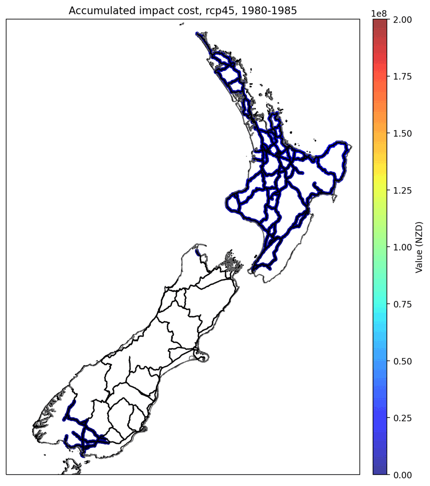
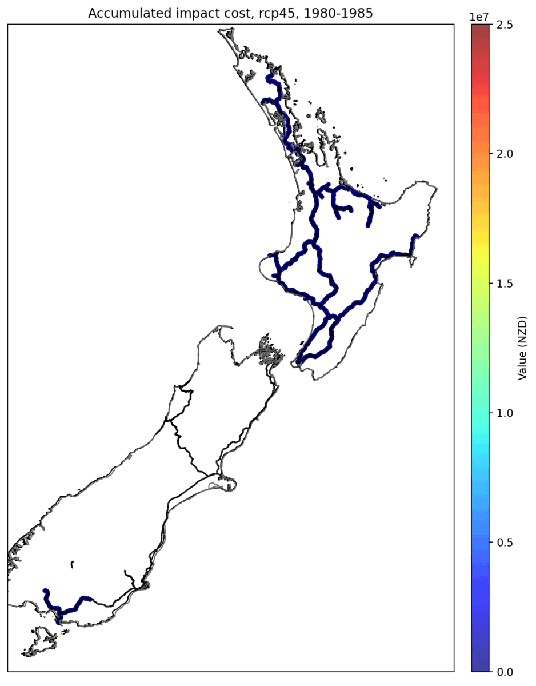
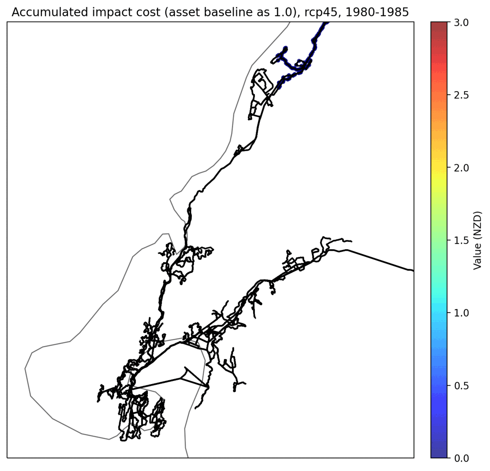

Welcome to ClimateRisk
#######

**ClimateRisk** is an open-source repository that conducts climate risk (e.g., tropical cyclone, flood, earthquake, landslide etc.)
and adaptation analysis, focusing on the New Zealand transportation sector (e.g., State highway, local roads, railway, supply chain, road fatalities etc.).

The base model used in **ClimateRisk** is `CLIMADA <https://wcr.ethz.ch/research/climada.html>`_.
Additional New Zealand specifications have been added with a range of options for visualization. The codes for **ClimateRisk** can be accessed `here <https://github.com/jzanetti/ClimateRisk>`_.

|pic1| |pic2| |pic3|

(``left``: accumulated impact costs (between 1980 and 2080) from ``rcp45`` for the state highway, with a total of estimated state highway asset value of $52b; 
``middle``: accumulated impact costs (between 1980 and 2080) from ``rcp45`` for the railway system, with a total of estimated state highway asset value of $2.1b; 
``right``: uaccumulated impact costs (between 1980 and 2080) from ``rcp45`` for Metlink, the normalized asset value 1.0 is used)

.. note::

   This is an onging effort. Any issues/suggestions for this system please go to **Sijin ZHANG** at zhans@transport.govt.nz

Contents
==========

.. toctree::

   Installation
   Concepts
   Cfg
   data
   Cookbook
   Reference